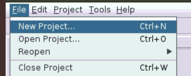
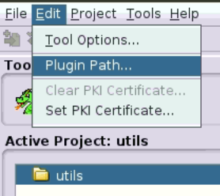

# SigmaDiff   

## Dependency
- python                    3.9.7

- pytorch                   1.9.1

- gensim                    4.0.1

- scipy                     1.10.1

- torch-geometric           2.0.4

- numpy                     1.23.2

- ghidra                    9.2.2 or higher

- torch-scatter             2.0.9

- torch-sparse              0.6.12

**import json-simple-1.1.1.jar to ghidra**

json-simple-1.1.1.jar is located at ./ghidra_script. And we need to import it to ghidra in order to run VSAPCode.java. Please do the following steps:

Option 1:

Add jar to `<ghidra install dir>/Ghidra/patch/`.

Option 2:

1. create a new project called utils

2. add the path to json-simple-1.1.1.jar in Edit->Plugin Path. Note that you need to use this project name (e.g., utils) later when running ghidra.

For more information about importing third-parity jars to ghidra, please refer to:
https://github.com/NationalSecurityAgency/ghidra/issues/479

## Dataset
The sample dataset for Diffutils is located at ./data/binaries.
To obtain the complete dataset of our evaluation, you
can download it from: https://drive.google.com/drive/folders/1IimJi-03B4ljogtk4hli6B5G12MnpWJ-?usp=sharing.

# Supported OS and hardware requirements
- Ubuntu system
- NVIDIA GPU with compute capability of 5.2 (or above) and with at least 11GB of memory

## Run SigmaDiff
To test the sample data, update the ghidra-related locations, and run ./run.sh.

Otherwise, run python sigmadiff.py with specific arguments (see examples in run.sh).

| Option    | Explanations |
| -------- | ------- |
| --input1 | The path of input bin file 1 or a group of bin files |
| --input2 | The path of input bin file 2 or a group of bin files |
| --ghidra_home | Home directory of Ghidra | 
| --output_dir | The output directory |
| --with_gt | Whether the input has ground truth or not |
| --src_dir | The home directory of source code, used for cross-version diffing evaluation |
| --ghidra_proj_name | The project name required by ghidra |

To run stripped binaries, use the --no-with_gt option, and the evaluation process will be skipped.
The bin file name cannot contain the underscore mark.

## Type Matrix
The type compatibility matrix we mentioned in paper is implemented in check_compatibility function in dgmc.py. In summary,

| Type    | Compatible With |
| -------- | ------- |
| undefined  | all types |
| undefined * | all types |
| void * | all types |
| undefined8 | long, ulong, double, size_t |
| undefined4 | float, int, wchar_t, uint |
| undefined2 | short, ushort |
| byte | char |
| long | ulong |
| short | ushort |
| int | uint |
| pointer type | other pointer types |
