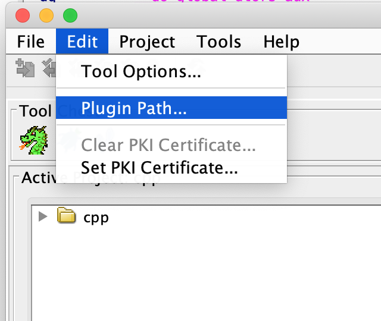

# SigmaDiff

## Dependency
python                    3.9.7

pytorch                   1.9.1

gensim                    4.0.1

scipy                     1.10.1

torch-geometric           2.0.4

ghidra                    9.2.2 or higher

import json-simple-1.1.1.jar to ghidra

https://github.com/NationalSecurityAgency/ghidra/issues/479

## Dataset

## Run SigmaDiff
Select the type: with ground truth or without ground truth.

## Example
binary stored in ./data
output files stored in ./out

`python sigmadiff.py --input1 /path/to/SigmaDiff/data/Zoom-5.9.31911/libturbojpegstripped.so --input2 /path/to/SigmaDiff/data/turbojpeg-2.1.2/libturbojpegstripped.so --ghidra_home /path/to/ghidra_9.2.2_PUBLIC --output_dir /path/to/SigmaDiff/out`

## Type Lattice
