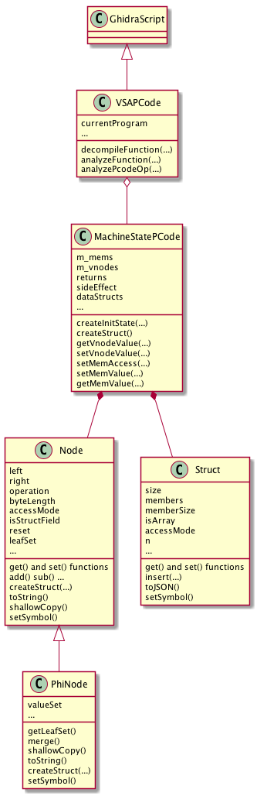
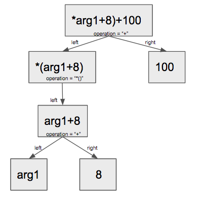
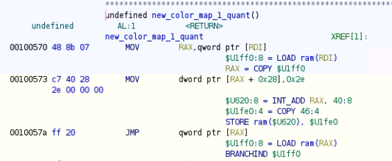
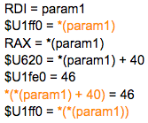
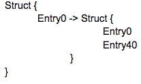

# ghidra_script

This tool conducts symbolic VSA analysis and extract semantic features as well as data structures of a binary function

## Overview

### Node, PhiNode class

Node and PhiNode class are used to represent the symbolic values, they're organized as a binary expression trees, the left field and right field are some other Node object, operation field represents the operator such as addition, subtraction or dereferencing. A Node object is a leaf node if it's left and right field are null. Constant values and variables are stored in leaf nodes, we use the operation field to stored their value. If we traverse the binary expression tree using a depth-first search, we got the complete symbolic value. For example, for a symbolic value “\*(arg1 + 8) + 100”, the binary expression tree is like:
    

    
PhiNode is a subclass of Node that represents the phi-node in SSA form, which means a variable that merges all the incoming versions of the variable to create a new name for it. PhiNode has a valueSet field that stores all the incoming versions. Merge method is used for merging a version to the valueSet.

### MachineStatePCode class

MachineStatePCode class records the current status, it records the symbolic value (represented by Node) for each PCode varnode. A varnode can represent either a register, a temparory variable or memory location. We use the map m_mems to map memory varnodes to their symbolic value and the map m_vnodes to map for other varnodes.

### VSAPCode class

VSAPCode class extends GhidraScript, Value-Set analysis is performed, and the corresponding results are stored in MachineStatePCode.

### Struct class

After analysing the binary program, the addresses for all the load and store instructions are recorded, we use these addresses to infer the data structures and record in Struct objects.

## Details

### Symbolic Value-Set Analysis on PCode

- Do initialization on machine state.
The initial machine state includes symbolic values for function arguments, RSP register and some global values. We are going to use these initial symbolic values to represents all of other variables that will appear in the function. Since we are analysing on the high function level, we already have the information about function arguments, they are represented by some varnode. We assign the leaf Node with value "arg#id" to these varnode, and store them in to the map. We don't need to initialize the registers except for RSP because in high function level, other registers won't be used without defining first, but RSP will be used to access some locations on stack, thus we assign a symbolic value "RSP" to the RSP register. We also need to do initialization for all the global values and symbols. For all the memory locations, we don't need to initialize them because we are going to handle it while analysis.

- Go over all the pcodes, update machine state, repeat until there's no change
	Start from the begining of the function, we go through all the pcodes that assign the values from right-hand-side to left-hand-side and do symbolic value-set analysis. Technically, we retrieve the symbolic values for the right-hand-side varnodes from MachineStatePCode object, and do some symbolic calculations (e.g. addition) according to the particular pcode operator, and assign the calculated symbolic value to the left-hand-side varnodes. For example, for the following function,

    
    
    we can get the following value set results:

    
    
    When encountering a call instruction, we don’t go further into the callee function, but simply assign the return value as “RFC” (return from call). When encountering a store instruction, we will store the varnode of address and symbolic value for the stored value as a key-value pair into the m\_mems filed in machine state. When encountering a load instruction, we will look for the symbolic value from m\_mems field in machine state, if m\_mems contains value of this address varnode, which means we previously stored a value to this address, we will directly use it. If m\_mems doesn’t contain value of this address, we will looking for the symbolic value for this address in m\_vnodes, add a dereferencing operator outside this symbolic value and store it into m\_mems.
	 - Handle phi-node
	Since the pcode on high function level satisfy the SSA form, thus phi-node is included. Ghidra uses MULTIEQUAL operation to represent a copy from one or more possible locations, and we use the PhiNode object's valueSet field to store these possible values (each represents by a Node object).
	While going over the pcodes, some inputs for the MULTIEQUAL operation might be missing, for example, in the first iteration of a loop. Thus we need to go over the pcodes multiple times until the values for all varnodes are stable. 
	
### Extract data structures and generate semantic feature formulas
- extract data structures

After the symbolic VSA, all the load and store instructions are recorded, we use these accessed addresses to infer the data structures and record in Struct objects. For example, in the previous example, we have collected three addresses: 
```
*(param1)
*(*(param1) + 40)
*(*(param1))
```
So we can construct a struct object for param1, which is:



If the right-hand-side of the addition operator is not a constant value, but a more complexed expression, we will give up unless the expression has a PhiNode involved. In that case, the offset of this data structure contains multiple values, so we mark this data structure as an array.

If the address itself is an PhiNode, we took one Node from the valueSet of this PhiNode and do the data struct extraction, and mark it as an array (this step may lead to false positive arrays).
- generate semantic feature formulas

As mentioned before, we only need to do depth-first search on the Node object to get the semantic features we recorded during the symbolic VSA. However, for PhiNode, we have to handle it differently since it contains more than one value which can be very complicated. To simply the PhiNode, we will represents a PhiNode by the it’s leaf set. But we don’t include the constant values to the leaf set because the constant value may vary in loops which is usually represented by PhiNode. We also consider the structure fields as leaf nodes since the structure fields (e.g. arg1+8) are more informative compared to the original leaf (e.g. arg1). In order to do that, we will mark the data structure fields we found as leaf nodes when extracting the data structures. And when collecting the leaf node set, we won’t go deeper any more once we encounter a data structure field.